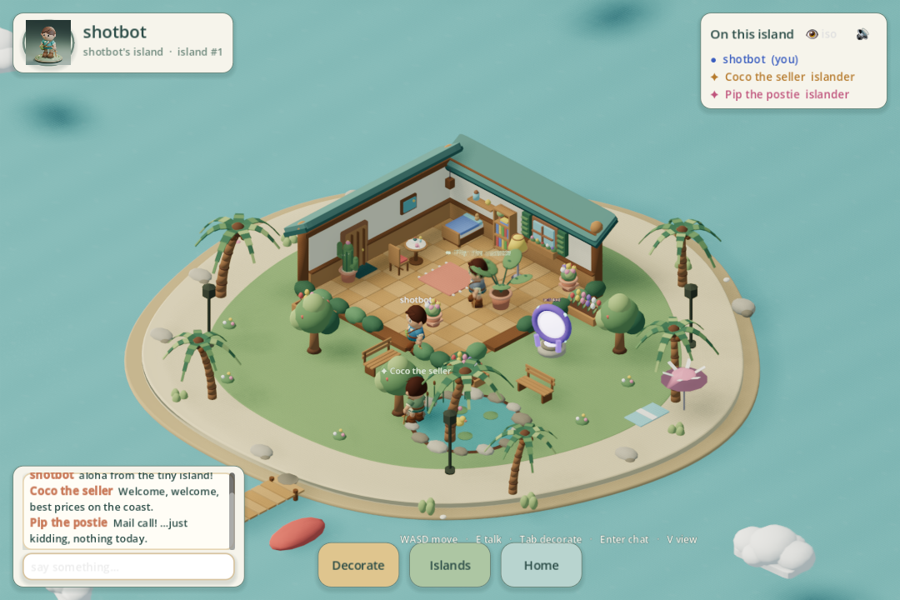

# Causeway Bay Coast

A tiny social island game in the spirit of console-era Wonder Boy: everyone gets a small
house on a tropical island, decorates it and the garden, chats, and hops to friends' islands
through portals.



- **Backend**: Rust (axum WebSocket + SQLite), JSON protocol, JSONL event log
- **Frontend**: Godot 4.7 (GDScript), isometric 3D with soft shadows, ambient occlusion and a coastal PBR palette
- **Test client**: Rust CLI with an end-to-end smoke scenario
- **Art**: the supplied `modeling/island_adventurer.blend` is exported through Blender into
  an animated Godot avatar (Idle / Walk / Wave). The island and furniture are generated
  in Blender, with a rounded shoreline and continuous animated ocean.
- **Islanders**: server-driven NPCs that wander, chat, greet, follow you and hold dialogues
  with choices (tips, stories, gifts)
- **Views**: isometric third-person or first-person, keyboard or mouse for everything

```
make server      # backend on ws://127.0.0.1:8787/ws  (data in ~/.causewaybaycoast/server)
make start       # build, import, then run server + Godot in the background
make stop        # stop only the server + client launched from this checkout
make run         # Godot client
make format      # format Rust, Python and GDScript (installs pinned tools on first run)
make format-check # check formatting without changing files
make cli NAME=bob
make test        # cargo test + CLI smoke scenario
make flow-check  # Godot flow check: controls, chat, NPCs, portals, reconnect
make assets      # rebuild the Blender world, polished island and adventurer GLBs
make adventurer  # export the supplied character with its game rig and animations
make portal-assets # rebuild the Blender pedestal for the Godot particle portal
make textures    # regenerate textures with Grok (XAI_API_KEY)
make ui          # regenerate HUD icons with Grok
make package     # standalone macOS release client app + ZIP, and backend binaries -> dist/
```

`make start PORT=8794 DATA=/tmp/coast-demo` selects another port and data directory;
the client login URL follows `PORT`. Logs and process records are in `build/run/`.
Repeated starts reuse the managed processes. Stop them before changing ports.

Two offline demo friends, **Sunny (demo)** and **Marina (demo)**, are created on server
startup. Click your portal and choose either island to test travel without another
player. New players have a starter portal linked to Sunny; walk into it to visit.
Use **Home** to return. Demo friends are sample destinations, not online users.

Packaging requires Godot **4.7.2** on macOS. The first `make package` downloads the
official export templates (about 1.2 GB), verifies their SHA-256, and caches the macOS
template under `build/templates/`. Open `dist/CausewayBayCoast.app` to run the release
client without the Godot editor. Share `dist/CausewayBayCoast-macOS.zip`; the server
is separate. The app is locally signed, not notarized for public distribution.

This is a local prototype with name-only login. Read [SECURITY.md](SECURITY.md)
before exposing a server or publishing data. Runtime data and build artifacts are
excluded from Git. Chat persistence is off unless `COAST_LOG_CHAT=1` is set.

See [docs/PIPELINE.md](docs/PIPELINE.md) for the current art pipeline and verification.
On your island, click **Remove**, then click a decoration to remove it with a mint-and-gold particle burst. Click **Done** or press **Esc** to exit. Removal is confirmed by the server and visible to visitors; fixed scenery stays in place.
See [PLAN.md](PLAN.md) for the architecture, protocol and asset pipeline.

## License

MIT (see [LICENSE](LICENSE)). All 3D assets are original and generated by the scripts in this
repository. Generated textures/icons in `godot/assets/textures` and `godot/assets/ui` were
produced with Grok Imagine; check xAI's terms for redistribution of generated images before
publishing them under the same license.
